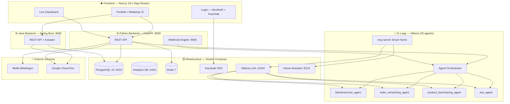
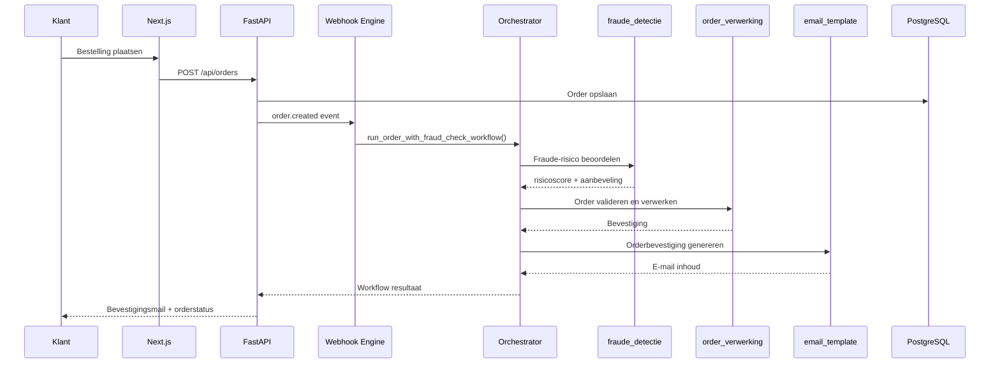

<div align="center">

# 🚀 VorstersNV Platform

**Full-stack AI-powered webshop & business platform — gebouwd door Koen Vorsters**

[](https://python.org)
[](https://nextjs.org)
[](https://fastapi.tiangolo.com)
[](https://spring.io/projects/spring-boot)
[](https://postgresql.org)
[](https://docker.com)
[](agents/)
[](tests/)
[](LICENSE)

</div>

---

## 📋 Inhoudsopgave

- [Over het project](#-over-het-project)
- [Screenshots](#-screenshots)
- [Architectuur](#-architectuur)
- [Technologiestack](#-technologiestack)
- [AI-agents](#-ai-agents)
- [Hoe het werkt](#-hoe-het-werkt)
- [Snel starten](#-snel-starten)
- [API documentatie](#-api-documentatie)
- [Projectstructuur](#-projectstructuur)

---

## 🧭 Over het project

VorstersNV is een volledig zelfgebouwd bedrijfsplatform voor een KMO-webshop. Het combineert moderne web-development met lokale AI (via [Ollama](https://ollama.ai)) om bedrijfsprocessen zoals orderverwerking, klantenservice en productbeschrijvingen te automatiseren — **volledig zonder externe AI-API's**.

**Kernfunctionaliteit:**

| Functie | Beschrijving |
|---------|-------------|
| 🌐 **Portfolio & website** | Persoonlijke portfolio met projecten, blog en over-mij |
| 📊 **Live dashboard** | Real-time monitoring van alle services, AI-agents en logs |
| 🤖 **AI-agents** | 25 lokale Ollama YAML-agents voor klantenservice, SEO, productbeschrijvingen, orderverwerking en smart home |
| 🛍️ **Webshop backend** | FastAPI REST API (Python) + Spring Boot API (Java) met producten, orders, voorraad en Mollie betalingen |
| 🔐 **SSO Authenticatie** | Keycloak single sign-on met JWT tokens |
| 📬 **Webhooks** | Real-time order- en betaalverwerking via HMAC-beveiligde webhooks |
| 🏠 **Smart Home** | MCP server + Home Assistant integratie via Ollama LLM |

---

## 📸 Screenshots

> **💡 Tip:** Voeg hier je eigen screenshots toe door ze te uploaden naar de `docs/screenshots/` map en de links hieronder te vervangen.

### 🏠 Homepage — Portfolio Landing

```
┌─────────────────────────────────────────────────────────────────┐
│  🔷 Koen Vorsters                    Home  Projecten  Dashboard │
├─────────────────────────────────────────────────────────────────┤
│                                                                   │
│         Full-Stack Developer                                      │
│         AI Engineer & IoT Specialist                             │
│                                                                   │
│   ┌──────────┐  ┌──────────┐  ┌──────────┐  ┌──────────┐       │
│   │  4+      │  │  15+     │  │  9+      │  │  ∞       │       │
│   │  Jaar    │  │ Projecten│  │ Techno-  │  │ Passie   │       │
│   │ ervaring │  │          │  │ logieën  │  │ voor tech│       │
│   └──────────┘  └──────────┘  └──────────┘  └──────────┘       │
│                                                                   │
│   ┌─────────────┐ ┌─────────────┐ ┌─────────────┐              │
│   │ 🧠 Full-Stack│ │ 🤖 AI / ML  │ │ 📡 IoT       │             │
│   │ Development │ │ Integration │ │ & Embedded   │             │
│   └─────────────┘ └─────────────┘ └─────────────┘              │
└─────────────────────────────────────────────────────────────────┘
```

> 📷 Vervang dit door: ``

---

### 📊 Live Dashboard

```
┌─────────────────────────────────────────────────────────────────┐
│  System Dashboard                              ↻ Refresh        │
├──────────────┬──────────────┬──────────────┬────────────────────┤
│ Uptime       │ Services     │ AI Runs      │ Aktieve Agents     │
│ 14d 7h 23m   │ 5/6 online   │ 1,065        │ 3 / 4              │
├──────────────┴──────────────┴──────────────┴────────────────────┤
│ Services                          │ AI Agents                   │
│  ✅ FastAPI Backend   :8000  12ms │  🤖 Klantenservice  actief  │
│  ✅ PostgreSQL        :5432   3ms │  🤖 Product Beschr. actief  │
│  ✅ Redis Cache       :6379   1ms │  💤 SEO Agent       standby │
│  ✅ Keycloak Auth     :8080  45ms │  🤖 Order Verwerking actief │
│  ❌ Ollama LLM        :11434  —   │                             │
│  ✅ Webhook Engine    :9000   8ms │                             │
├───────────────────────────────────┴─────────────────────────────┤
│ 14:32:01  [INFO]  Webhook ontvangen: order.created              │
│ 14:31:45  [INFO]  Agent run voltooid: klantenservice (324ms)    │
│ 14:30:12  [WARN]  Redis cache miss ratio > 15%                  │
│ 14:28:33  [ERROR] Ollama LLM: connection refused op poort 11434 │
└─────────────────────────────────────────────────────────────────┘
```

> 📷 Vervang dit door: ``

---

### 🗂️ Projecten pagina

```
┌─────────────────────────────────────────────────────────────────┐
│  Mijn Projecten                                                  │
│  [ Alle ] [ Full-Stack ] [ AI/ML ] [ IoT ] [ DevOps ]           │
│  🔍 Zoek projecten...                                            │
├───────────────────┬─────────────────────┬───────────────────────┤
│ 🖥️ VorstersNV     │ 🧠 AI Orchestrator   │ 📡 IoT Pipeline       │
│ Platform          │                     │                       │
│ Full-stack + AI   │ Lokale LLM agents   │ MQTT + Cloud          │
│ [Python][Docker]  │ [Python][Ollama]    │ [IoT][Embedded]       │
│ ● Actief          │ ● Actief            │ ✓ Afgerond            │
├───────────────────┴─────────────────────┴───────────────────────┤
```

> 📷 Vervang dit door: ``

---

### 🔐 Login — Keycloak SSO

```
┌─────────────────────────────────────────────────────────────────┐
│                                                                   │
│              🔷 VorstersNV                                        │
│                                                                   │
│         ┌─────────────────────────────────┐                      │
│         │  Welkom terug                   │                      │
│         │  Meld je aan bij je account     │                      │
│         │                                 │                      │
│         │  Email ________________________ │                      │
│         │  Wachtwoord ____________________ │                     │
│         │                                 │                      │
│         │  [ Aanmelden via Keycloak SSO ] │                      │
│         └─────────────────────────────────┘                      │
└─────────────────────────────────────────────────────────────────┘
```

> 📷 Vervang dit door: ``

---

### 📖 API Documentatie (Swagger UI)

```
┌─────────────────────────────────────────────────────────────────┐
│  VorstersNV API  v1.0.0            localhost:8000/docs           │
├─────────────────────────────────────────────────────────────────┤
│  🛍️ products                                             ▼      │
│     GET  /api/products           Lijst van producten            │
│     POST /api/products           Nieuw product aanmaken         │
│  📦 orders                                               ▼      │
│     GET  /api/orders/{id}        Order ophalen                  │
│     POST /api/orders             Order aanmaken                 │
│  📊 inventory                                            ▼      │
│     GET  /api/inventory/levels   Voorraadniveaus                │
│  🤖 dashboard                                            ▼      │
│     GET  /api/dashboard/agents   AI-agent statussen             │
└─────────────────────────────────────────────────────────────────┘
```

> 📷 Vervang dit door: ``

---

## 🏛️ Architectuur



---

### Dataflow — Order verwerking



---

## 🛠️ Technologiestack

| Laag | Technologie | Doel |
|------|-------------|------|
| **Frontend** | Next.js 16.2, React 19, TypeScript strict | UI & portfolio |
| **Styling** | Tailwind CSS v4, Framer Motion | Animaties & glassmorphism design |
| **Auth (FE)** | NextAuth.js + Keycloak | SSO login |
| **Python API** | FastAPI 0.115, Python 3.12, async SQLAlchemy | REST API (hoofdbackend) |
| **Java API** | Spring Boot 3.3.5, Java 21, Maven | Alternatieve backend (productie-deploy) |
| **Database** | PostgreSQL 16 (:5432 operationeel, :5433 analytics), SQLAlchemy, Alembic | Data & migraties |
| **Analytics** | Ster-schema: sales_facts + agent_performance_facts | Business intelligence |
| **Cache** | Redis 7 | Performance caching |
| **Auth (BE)** | Keycloak + JWT | Toegangscontrole |
| **Betalingen** | Mollie | iDEAL, creditcard, Bancontact |
| **AI/LLM** | Ollama, LLaMA 3, Mistral (25 agents) | Lokale AI inference |
| **Smart Home** | MCP server + Home Assistant | IoT & agent integratie |
| **Containers** | Docker Compose | Lokale & cloud-omgeving |
| **CI/CD** | GitHub Actions (4 jobs) → Google Cloud Run | Tests & deployment |
| **Code kwaliteit** | Ruff, mypy, pytest, ESLint, TypeScript strict | Linting & type checks |

---

## 🤖 AI-agents

Het platform bevat **25 Ollama YAML-agents** (volledig lokaal) + een AI-development ecosysteem in `.claude/`.

### Overzicht per categorie

| Categorie | Agents | Aantal |
|-----------|--------|--------|
| **Webshop** | klantenservice, order_verwerking, fraude_detectie, retour_verwerking, email_template, voorraad_advies | 6 |
| **Content** | product_beschrijving, seo_agent, content_moderatie, email_template | 4 |
| **AI/Dev** | developer_agent, architect_agent, clean_code_reviewer, ddd_modeling, domain_validation | 5 |
| **Testing** | test_design, test_orchestrator, regression_selector, test_data_designer, automation_agent | 5 |
| **Smart Home** | betaling_status_agent, checkout_begeleiding, loyaliteit_agent, playwright_mcp, security_permissions, voorraad_advies | 5 |

> 📋 Volledig overzicht: zie [`agents/README.md`](agents/README.md)

### Parent agents (webshop kern)

| Agent | Model | Temperatuur | Rol |
|-------|-------|-------------|-----|
| `klantenservice_agent` | llama3 | 0.4 | Klantvragen, orders, escalaties |
| `order_verwerking_agent` | llama3 | 0.1 | Ordervalidatie, facturen, notificaties |
| `product_beschrijving_agent` | mistral | 0.7 | SEO-teksten, USP's, FAQ |
| `seo_agent` | mistral | 0.5 | Keywords, meta-tags, schema markup |

### Sub-agents (nieuw)

| Sub-agent | Model | Triggered door | Doel |
|-----------|-------|----------------|------|
| `fraude_detectie_agent` | llama3 | order_verwerking, klantenservice | Risicoscore 0–100, fraude-signalen detecteren |
| `retour_verwerking_agent` | llama3 | klantenservice, order_verwerking | Retouren beoordelen + terugbetalingen |
| `email_template_agent` | mistral | klantenservice, order, retour | Klantgerichte e-mails schrijven |
| `voorraad_advies_agent` | mistral | order_verwerking | ABC-analyse, besteladvies, stockout alerts |

### Agent workflow — Fraude-check bij nieuwe order

```
order.created
     │
     ▼
┌─────────────────────┐
│ fraude_detectie     │  → risicoscore berekenen
│ (llama3, temp=0.1)  │  → signalen detecteren
└────────┬────────────┘
         │ score ≤ 60: doorgaan
         ▼
┌─────────────────────┐
│ order_verwerking    │  → order valideren
│ (llama3, temp=0.1)  │  → factuur genereren
└────────┬────────────┘
         │
         ▼
┌─────────────────────┐
│ email_template      │  → orderbevestiging schrijven
│ (mistral, temp=0.6) │  → verzenden via /api/notifications
└─────────────────────┘
```

### Prompt iteratie systeem

Alle agent-interacties worden gelogd in `logs/<agent_naam>/`. Feedback (rating 1–5) wordt bijgehouden zodat prompts systematisch verbeterd kunnen worden:

```python
from ollama.prompt_iterator import PromptIterator

iterator = PromptIterator("klantenservice_agent")

# Voeg feedback toe aan een interactie
iterator.add_feedback(interaction_id, rating=4, notes="Goed antwoord maar te lang")

# Analyseer alle feedback
stats = iterator.analyse_feedback()
# → {"gemiddelde_score": 3.8, "lage_scores": 2, "verbeter_suggesties": [...]}
```

---

## ⚙️ Hoe het werkt

### 1. Frontend — Next.js 16.2 App Router

De frontend gebruikt **Next.js 16.2** met App Router. Server Components voor statische pagina's, Client Components waar animaties of state nodig zijn.

```
frontend/app/
├── page.tsx              → Homepage (portfolio landing)
├── projecten/            → Projectenoverzicht + detail per slug
├── over-mij/             → CV, skills, tijdlijn
├── blog/                 → Blog artikelen
├── dashboard/            → Live system monitoring
├── shop/                 → Webshop product listing
├── winkelwagen/          → Winkelwagen & checkout
└── login/                → Keycloak SSO login
```

**Glassmorphism design** via Tailwind CSS:
```tsx
// GlassCard component
<div className="backdrop-blur-md bg-white/5 border border-white/10 rounded-2xl p-6">
  {children}
</div>
```

---

### 2. Backend — FastAPI (Python) + Spring Boot (Java)

Het platform heeft **twee backends**:

| Backend | Tech | Poort | Gebruik |
|---------|------|-------|---------|
| **FastAPI** | Python 3.12, async SQLAlchemy | `:8000` | Hoofd-API (lokale dev, AI-integratie) |
| **Spring Boot** | Java 21, Maven | `:8080` | Alternatieve backend (Cloud Run deployment) |

FastAPI heeft 8 routers, Swagger UI op `/docs` en CORS voor de Next.js frontend.

```
api/routers/
├── products.py    → GET/POST/PUT/DELETE /api/products
├── orders.py      → Order CRUD + status updates
├── inventory.py   → Voorraadniveaus + low-stock alerts
├── betalingen.py  → Mollie betaalintegratie
├── auth.py        → Token validatie + user info
└── dashboard.py   → Service health + agent statistieken
```

**Voorbeeld — product aanmaken met AI-beschrijving:**
```python
POST /api/products
{
  "naam": "Industriële sensor kit",
  "categorie": "elektronica",
  "kenmerken": ["IP67", "Bluetooth 5.0", "±0.1°C nauwkeurigheid"],
  "doelgroep": "industrieel",
  "tone_of_voice": "technisch"
}
# → AI genereert automatisch titel, beschrijving, SEO-tags, USP's en FAQ
```

---

### 3. Webhook Engine

Beveiligde webhook endpoints met HMAC-SHA256 verificatie. Triggered door Mollie en interne events.

```
/webhooks/
├── order-created    → fraude check + bevestigingsmail
├── order-paid       → factuur genereren + verzending starten
├── order-shipped    → track & trace notificatie
├── order-returned   → retour workflow starten
└── order-cancelled  → voorraad terugboeken
```

Elke webhook verifieert de handtekening:
```python
# HMAC-SHA256 verificatie
expected = hmac.new(secret.encode(), payload, hashlib.sha256).hexdigest()
assert hmac.compare_digest(f"sha256={expected}", signature)
```

---

### 4. Database — PostgreSQL + Alembic

Async SQLAlchemy met Alembic voor migraties.

```bash
# Nieuwe migratie aanmaken
alembic revision --autogenerate -m "add product table"

# Migraties uitvoeren
alembic upgrade head
```

---

## 🚀 Snel starten

### Vereisten

- Docker & Docker Compose
- Node.js 20+ (optioneel, voor lokale frontend dev)

### 1. Repository klonen

```bash
git clone https://github.com/koenvorster/Personal_project_VorstersNV.git
cd Personal_project_VorstersNV
```

### 2. Omgevingsvariabelen instellen

```bash
# Windows PowerShell
Copy-Item .env.example .env
# Pas DB_PASSWORD aan in .env
```

```env
DB_PASSWORD=verander-dit
NEXT_PUBLIC_API_URL=http://localhost:8080
```

### 3. Alles starten met Docker Compose

```powershell
# PowerShell – gebruik ; i.p.v. &&
docker compose up -d
```

Dit start:
| Service | Poort | Beschrijving |
|---------|-------|-------------|
| Spring Boot API | `:8080` | REST API + Actuator health |
| Next.js frontend | `:3000` | Webshop & portfolio |
| PostgreSQL | `:5432` | Database |

---

## ☁️ Google Cloud deployment

De applicatie draait op **Google Cloud Run** (frontend + backend) met **Cloud SQL** (PostgreSQL).
CI/CD via GitHub Actions — elke push naar `main` deployt automatisch.

### Eénmalige setup (uitvoeren via gcloud CLI)

```bash
# Login & project aanmaken
gcloud auth login
gcloud projects create vorstersNV --name="VorstersNV"
gcloud config set project vorstersNV

# APIs inschakelen
gcloud services enable run.googleapis.com sqladmin.googleapis.com \
  artifactregistry.googleapis.com cloudbuild.googleapis.com

# Artifact Registry (Docker images opslaan)
gcloud artifacts repositories create vorstersNV \
  --repository-format=docker --location=europe-west1

# Cloud SQL aanmaken (PostgreSQL 16)
gcloud sql instances create vorstersNV-db \
  --database-version=POSTGRES_16 --tier=db-f1-micro \
  --region=europe-west1
gcloud sql databases create vorstersNV --instance=vorstersNV-db
gcloud sql users set-password postgres --instance=vorstersNV-db \
  --password=WIJZIG_DIT

# Service account voor GitHub Actions
gcloud iam service-accounts create github-deployer
gcloud projects add-iam-policy-binding vorstersNV \
  --member="serviceAccount:github-deployer@vorstersNV.iam.gserviceaccount.com" \
  --role="roles/run.admin"
gcloud projects add-iam-policy-binding vorstersNV \
  --member="serviceAccount:github-deployer@vorstersNV.iam.gserviceaccount.com" \
  --role="roles/artifactregistry.writer"
gcloud projects add-iam-policy-binding vorstersNV \
  --member="serviceAccount:github-deployer@vorstersNV.iam.gserviceaccount.com" \
  --role="roles/iam.serviceAccountUser"
gcloud projects add-iam-policy-binding vorstersNV \
  --member="serviceAccount:github-deployer@vorstersNV.iam.gserviceaccount.com" \
  --role="roles/cloudsql.client"

# JSON-sleutel genereren → toevoegen als GitHub Secret
gcloud iam service-accounts keys create key.json \
  --iam-account=github-deployer@vorstersNV.iam.gserviceaccount.com
```

### GitHub Secrets instellen

Ga naar **repository → Settings → Secrets and variables → Actions** en voeg toe:

| Secret | Waarde |
|--------|--------|
| `GCP_SA_KEY` | Inhoud van `key.json` |
| `GCP_PROJECT_ID` | `vorstersNV` |
| `DB_PASSWORD` | Wachtwoord van Cloud SQL |

Na het instellen van de secrets: push naar `main` → GitHub Actions deployt automatisch.


## 📖 API documentatie

Na het starten van de backend:

| URL | Beschrijving |
|-----|-------------|
| `http://localhost:8000/docs` | Swagger UI — interactieve API docs |
| `http://localhost:8000/redoc` | ReDoc — leesbare API referentie |
| `http://localhost:8000/health` | Health check endpoint |
| `http://localhost:8000/openapi.json` | OpenAPI schema |

---

## 📁 Projectstructuur

```
Personal_project_VorstersNV/
├── agents/                  # 25 Ollama YAML-agents
│   ├── README.md            # Agent index met triggers en modellen
│   ├── klantenservice_agent_v2.yml
│   ├── order_verwerking_agent.yml
│   ├── product_beschrijving_agent.yml
│   ├── seo_agent.yml
│   ├── fraude_detectie_agent.yml
│   ├── retour_verwerking_agent.yml
│   ├── email_template_agent.yml
│   ├── voorraad_advies_agent.yml
│   └── ... (17 meer agents)
├── ollama/                  # Lokale AI-integratie
│   ├── client.py            # HTTP-client voor Ollama
│   ├── agent_runner.py      # Laadt YAML + voert agents uit
│   ├── orchestrator.py      # Multi-agent workflows
│   └── prompt_iterator.py   # Prompt-versies + feedback
├── api/                     # FastAPI backend (Python :8000)
│   ├── main.py              # App + CORS + Swagger
│   └── routers/             # products, orders, inventory, auth, betalingen, agents, notifications
├── backend/                 # Spring Boot backend (Java :8080)
│   ├── src/                 # Java source code
│   └── pom.xml              # Maven dependencies
├── mcp-server/              # MCP server voor Smart Home
│   ├── main.py              # FastAPI MCP endpoints
│   └── agents/              # Smart Home agent configs
├── webhooks/                # Webhook handlers
│   ├── app.py               # HMAC-verificatie + routing
│   └── handlers/            # order, payment, inventory handlers
├── frontend/                # Next.js 16.2 webshop & portfolio
│   ├── app/                 # App Router pages (shop, blog, dashboard...)
│   ├── components/          # Herbruikbare UI componenten
│   └── AGENTS.md            # Frontend agent conventions
├── .claude/                 # Claude Code AI ecosystem
│   ├── agents/              # 10 Claude agents (developer, reviewer, GDPR, DB...)
│   ├── skills/              # 7 skills (fastapi-ddd, nextjs, testing, gdpr, alembic...)
│   ├── capabilities/        # 7 geregistreerde capabilities
│   ├── scripts/             # validate-agents.mjs, check-env.mjs
│   └── README.md            # Volledig agent index
├── .github/
│   ├── agents/              # 21 GitHub Copilot agents
│   ├── workflows/           # CI (python, yaml, frontend, java) + deploy GCP
│   └── prompts/             # 7 herbruikbare Copilot prompts
├── prompts/                 # AI-prompt bestanden
│   ├── system/              # System prompts per agent
│   └── prepromt/            # Pre-prompts + iteratie-logs
├── tests/                   # Pytest test suite (28 tests)
├── documentatie/            # Projectdocumentatie
├── docker-compose.yml       # PostgreSQL + Spring Boot + Next.js
├── pyproject.toml           # Ruff + mypy + pytest configuratie
└── CLAUDE.md                # Claude Code instructies voor dit project
```

---

## 🧪 Tests uitvoeren

```bash
# Alle tests
pytest tests/ -v

# Met coverage
pytest tests/ --cov=. --cov-report=html

# Specifieke module
pytest tests/test_agents.py -v
```

**Huidige testdekking:** 28 tests — API (products, betalingen), webhooks, agent runner, YAML-validatie.

---

## 👤 Over de ontwikkelaar

**Koen Vorsters** — Full-Stack Developer, AI Engineer & IoT Specialist

- 🎓 Thomas More — Electronica ICT IoT (2019–2022)
- 💼 Product Engineer (2022–heden)
- 🚀 AI & IT Consulting voor KMO's

[](https://github.com/koenvorsters)

---

<div align="center">

*Gebouwd met ❤️ en lokale AI door Koen Vorsters*

</div>
